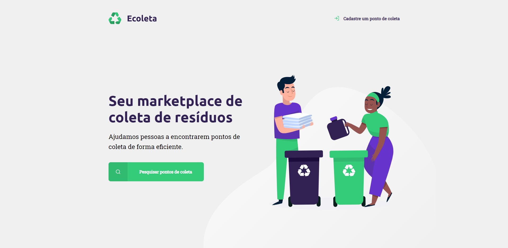
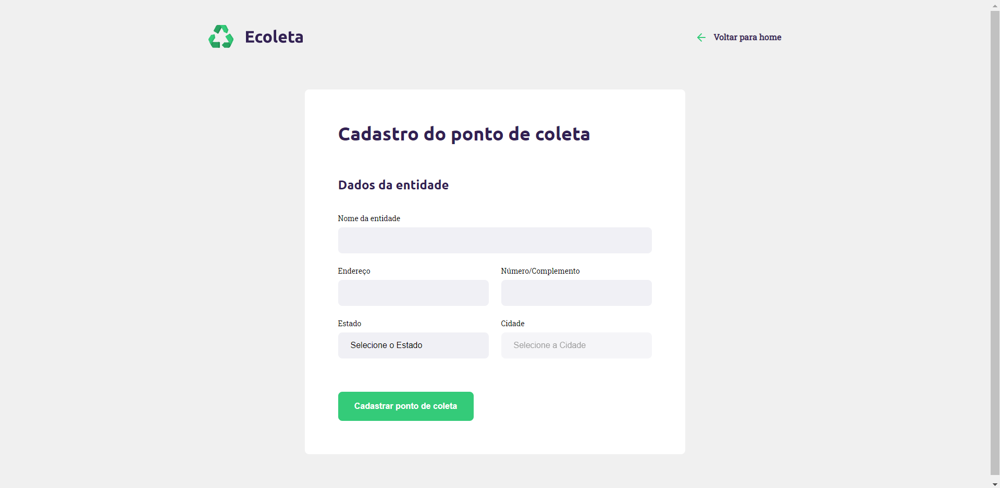
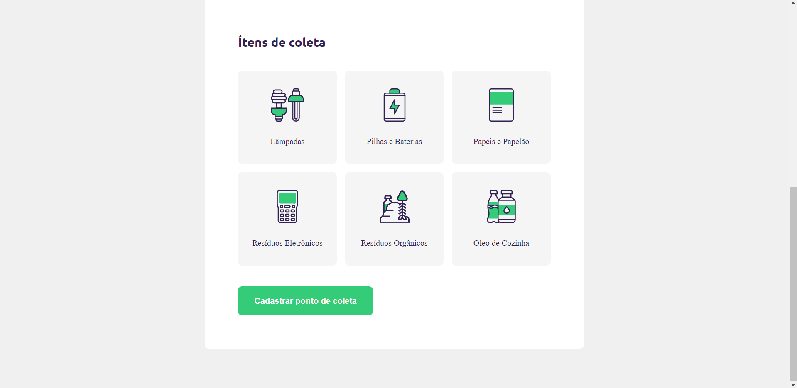
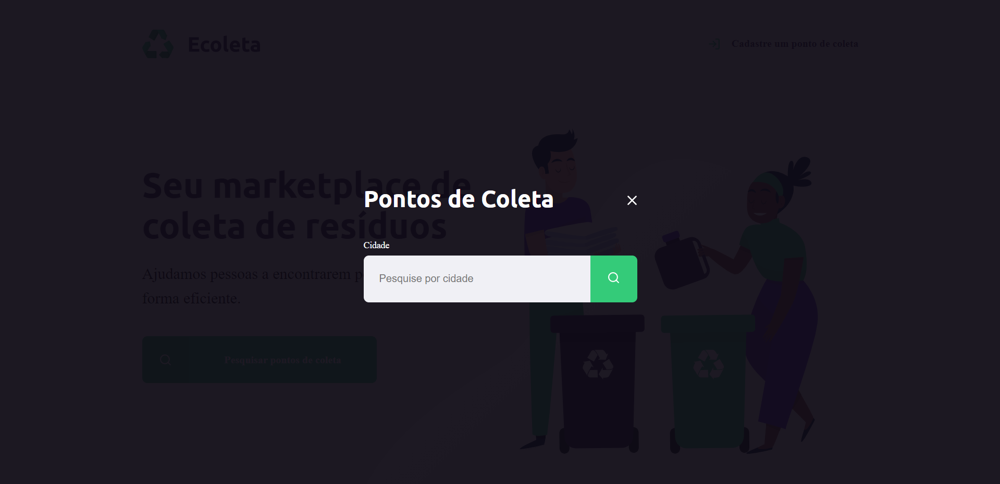
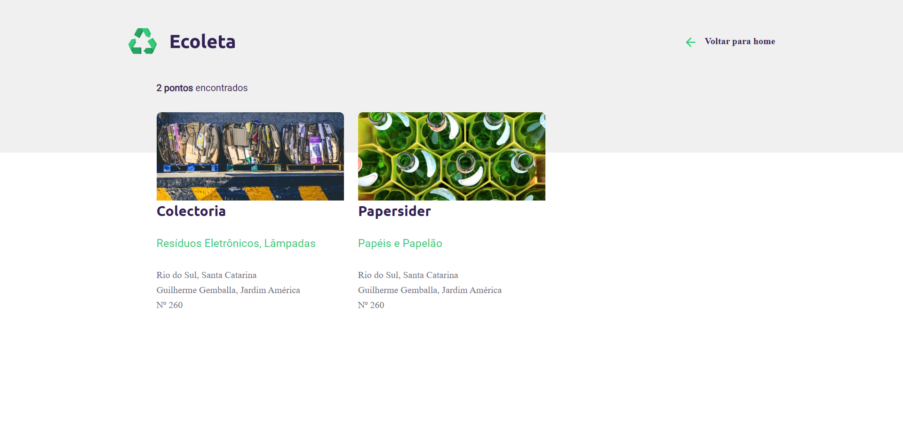

# #1 Next Level Week - Ecoleta
# O que é Next Level Week?
Next Level Week é um curso oferecido pela Rocketseat para desenvolver uma aplicação do início ao fim em uma semana, atualmente com dois níveis (Starter e Booster).

# Ecoleta
Essa aplicação é a de nível Starter, e utilizará conhecimentos de HTML, CSS e Javascript. 
A ideia é criar um marketplace para coletar resíduos. As empresas cadastram os pontos de coleta no site, que ficam disponíveis para os usuários encontraram o local mais próximo e apropriado para o descarte. 

# Resultado
# Dia 1
Finalização do desenvolvimento da home page do site. 

# Dia 2
Início do desenvolvimento da página de cadastramento de pontos de coleta

# Dia 3
Finalizado a página de cadastramento de pontos de coleta, a página para pesquisar pontos de coleta e a página de resultados.

# Dia 4
Refeita a estrutura de pastas e criação do servidor local.
